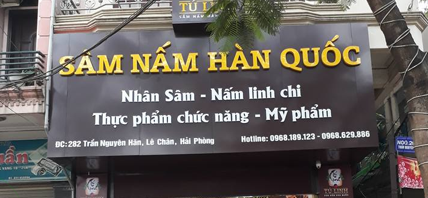

# End-to-End-OCR

Model OCR combines 2 models: Text detection and Text recognition . Model text detection using CRAFT and model text recognition using transformer OCR.

## Getting Started

```
git clone https://github.com/hoainv99/End-to-End-OCR.git
cd End-to-End-OCR
```


### Installing

A step by step series of examples that tell you how to get a development env running

Say what the step will be

```
pip install -r requirements.txt
```
and downloads pretrain model in [here](https://drive.google.com/drive/folders/1BUQRCzSF03eIu97dYJhrtTx2H3hG73uo?usp=sharing).
After downloaded, you have to move this folder in folder End-to-End-OCR.


## Running the tests

To test image using:

```
python3 OCR.py --image_path test/test2.png

```
now, the result below:


```
([[295, 1], [329, 1], [329, 21], [295, 21]], 'TU')
([[85, 50], [610, 50], [610, 134], [85, 134]], 'SAM NẤM HÀN QUỐC')
([[342, 135], [505, 135], [505, 173], [342, 173]], 'Nấm linh chi')
([[196, 144], [328, 144], [328, 174], [196, 174]], 'Nhân Sâm')
([[435, 164], [556, 164], [556, 207], [435, 207]], 'Mỹ phẩm')
([[147, 173], [417, 173], [417, 216], [147, 216]], 'Thực phẩm chức năng')
([[531, 215], [615, 215], [615, 233], [531, 233]], '0968.629.886')
([[397, 216], [525, 216], [525, 237], [397, 237]], 'Hotline: 0968.189.123')
([[88, 224], [358, 224], [358, 248], [88, 248]], 'ĐC: 282 Trần Nguyên Hãn, Lê Chân, Hải Phòng')
([[655, 229], [685, 229], [685, 243], [655, 243]], '00')
([[26, 248], [50, 248], [50, 272], [26, 272]], 'km')
([[536, 310], [576, 310], [576, 318], [536, 318]], 'TẠIỆNH')
```
## Authors

* **Nguyen Viet Hoai** - [github](https://github.com/hoainv99)


## License

## Acknowledgments

